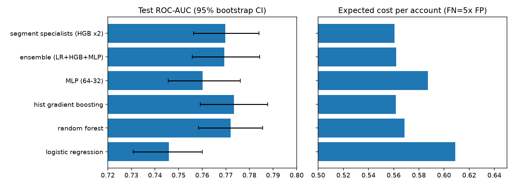

# credit-arena

Which model should score credit-card default risk, and when is a bigger or more complex one worth it? Six
model families on the UCI *Default of Credit Card Clients* data (30,000 accounts, 22% default), compared on
discrimination, calibration, **business cost**, latency and **fair-lending** behaviour, with paired
bootstrap tests so that "better" means statistically better.



## Setup

- Split 60 / 20 / 20 (train / validation / test), stratified, seed 0. Test is touched once.
- **Sex is excluded from the features** (fair-lending practice) and used only in a post-hoc audit.
- Engineered features: credit utilisation, repayment ratio, worst delinquency, count of late months.
- Decision threshold is chosen on the *validation* set to minimise expected cost, with a missed defaulter
  costing 5x a wrongly refused good borrower. Cost is reported per account on the test set.
- "Divide and conquer" is tested directly: an averaged ensemble of diverse models, and two specialist
  gradient-boosting models (one for accounts with any delinquency, one for the rest) vs a single global model.

## Results (6,000 held-out accounts)

| Model | AUC [95% CI] | KS | Brier | ECE | Cost / account | Fit | Inference |
|---|---|---|---|---|---|---|---|
| Logistic regression | 0.746 [0.731, 0.760] | 0.387 | 0.143 | 0.009 | 0.609 | 0.3 s | 0.2 us/row |
| Random forest | 0.772 [0.759, 0.786] | 0.407 | 0.137 | 0.011 | 0.569 | 3.3 s | 10.8 us/row |
| **Hist. gradient boosting** | **0.774 [0.759, 0.788]** | 0.414 | 0.137 | 0.012 | 0.562 | 3.1 s | 8.8 us/row |
| MLP (64-32) | 0.760 [0.746, 0.776] | 0.393 | 0.140 | 0.018 | 0.587 | 0.8 s | 1.4 us/row |
| Ensemble (LR + HGB + MLP) | 0.769 [0.756, 0.784] | 0.401 | 0.139 | 0.013 | 0.562 | 4.2 s | 10.4 us/row |
| Segment specialists (HGB x2) | 0.770 [0.756, 0.784] | 0.412 | 0.138 | 0.019 | 0.561 | - | - |

Full metrics (Brier, log-loss, PR-AUC, thresholds): `results.json`.

## What this says about model choice

- **Non-linear models beat logistic regression, and it is significant:** gradient boosting minus logistic
  regression = +0.027 AUC (paired bootstrap 95% CI [0.019, 0.036]); expected cost drops about 8%.
- **Nothing beats gradient boosting significantly.** Its lead over the random forest (+0.001), the ensemble
  (+0.004) and the segment specialists (+0.004) has intervals that include zero. On this data, stacking more
  models or splitting into segment specialists bought no measurable accuracy; it only added complexity and
  (for the ensemble) latency.
- **When to use logistic regression anyway:** it is ~40x faster at inference, best calibrated in practice
  (ECE 0.009), and the most interpretable. If a regulator needs reason codes, the cost of ~0.03 AUC is the price.
- **The MLP is dominated:** lower AUC, worse calibration, no speed advantage over boosting.

## Fair-lending check

Sex was not a model input, yet decline rates still differ because the inputs correlate with it. Approval-rate
ratio (lower group / higher group) at each model's cost-optimal threshold, against the 0.80 four-fifths rule:

| Model | Approval ratio |
|---|---|
| Logistic regression | 0.96 |
| MLP | 0.92 |
| Segment specialists | 0.92 |
| Hist. gradient boosting | 0.89 |
| Random forest | 0.89 |
| Ensemble | 0.89 |

All pass, but the most accurate models sit closest to the line: a real accuracy-vs-parity trade-off. AUC by sex differs by
0.0001-0.020 depending on the model (largest for logistic regression). This is a screening check, not a full disparate-impact analysis.

## Caveats

- One dataset (Taiwan, 2005), one split seed. The ranking among the top models is not stable enough to claim;
  the gap to logistic regression is.
- At a 5:1 cost ratio and 22% base rate the cost-optimal threshold flags 45-55% of accounts for decline, which
  reflects the cost assumption, not a recommended policy.
- Models use near-default hyperparameters and were not exhaustively tuned; a tuned gradient-boosting library
  (XGBoost / LightGBM) may widen the gap.

## Run

```bash
python -c "from sklearn.datasets import fetch_openml as f; d=f(data_id=42477,as_frame=True,parser='auto'); d.data.assign(target=d.target).to_csv('data.csv',index=False)"
python run.py && python -m pytest tests
```

Requires Python 3.10+, numpy, pandas, scikit-learn, matplotlib.
